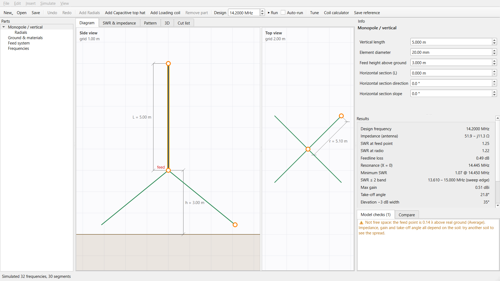
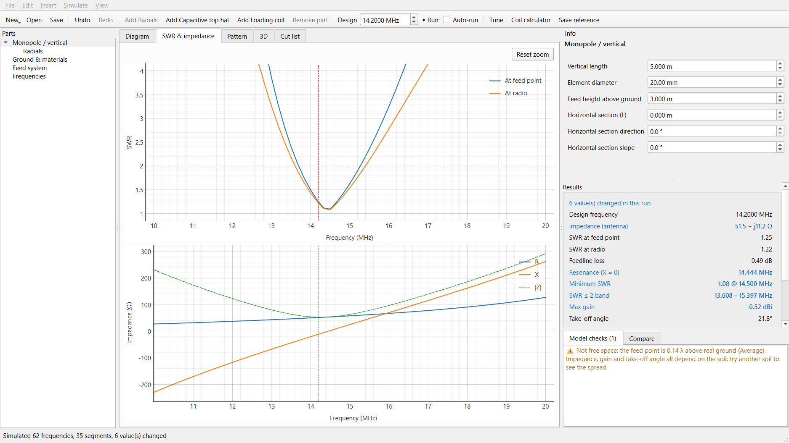
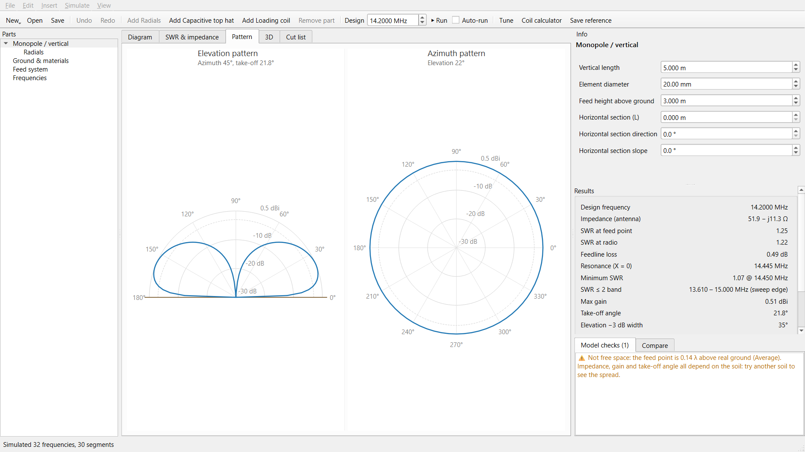
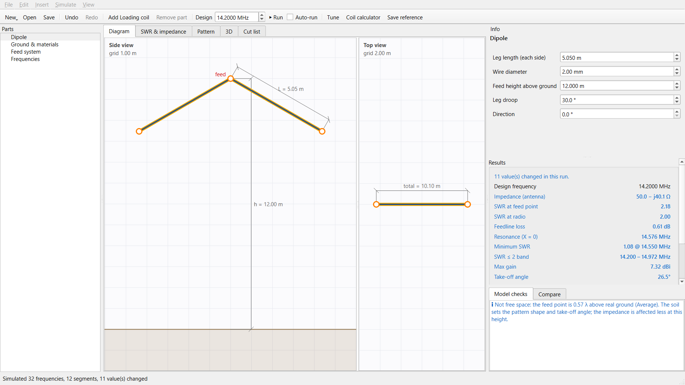
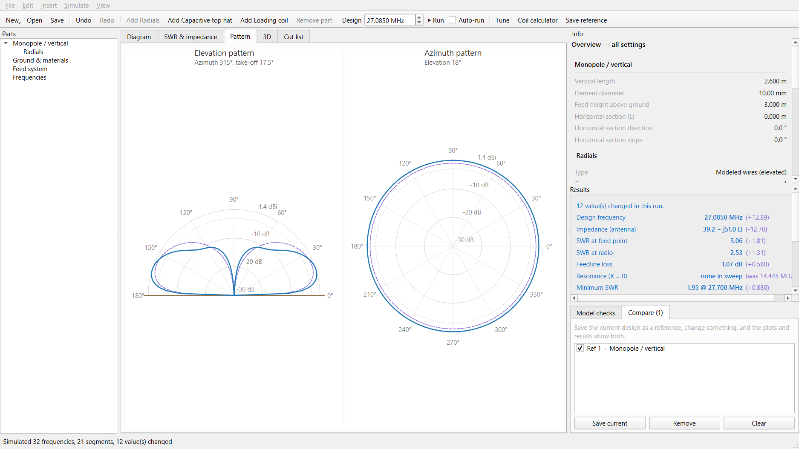
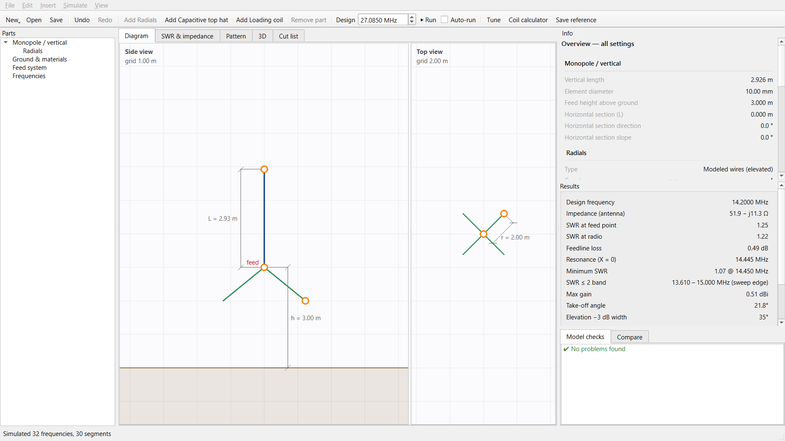
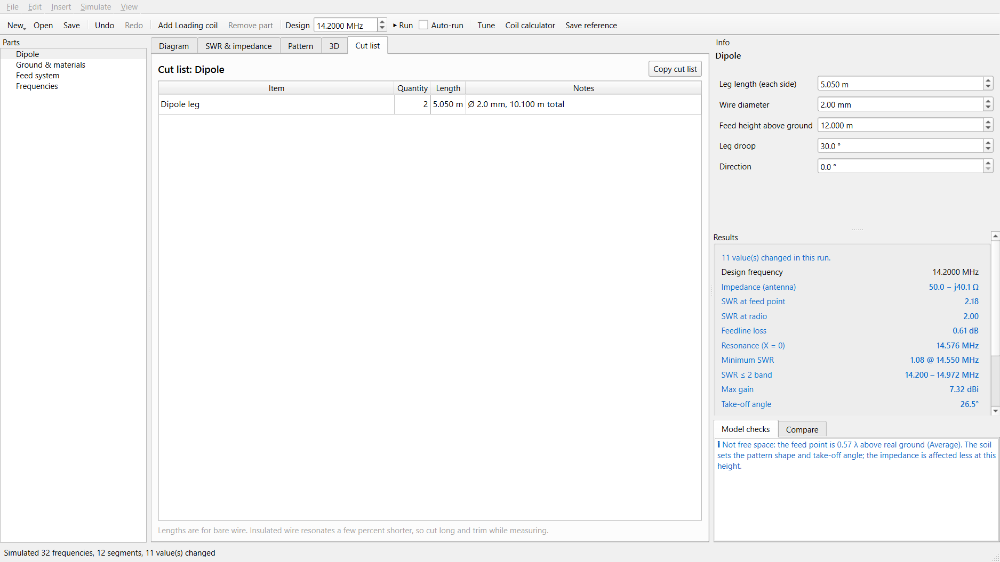
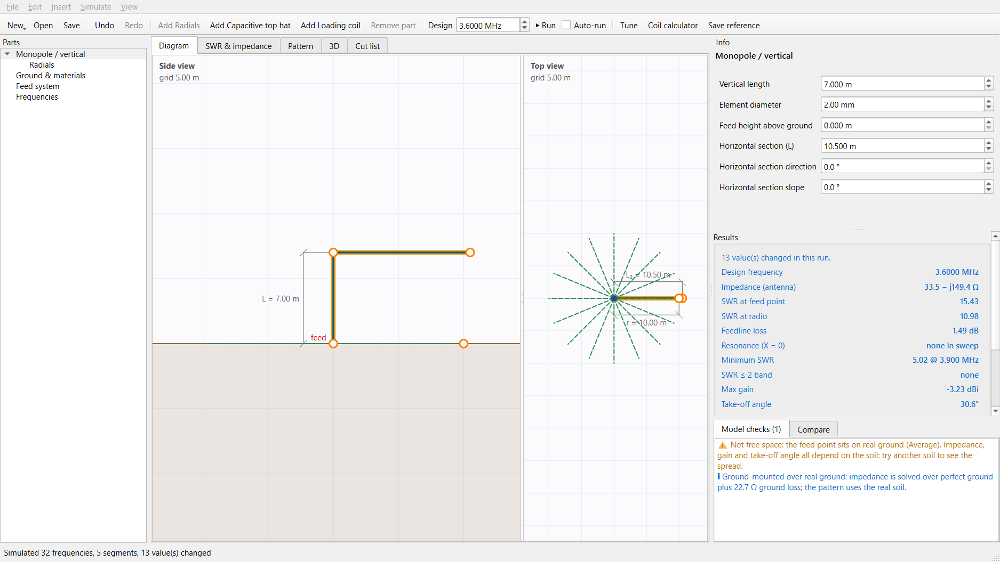
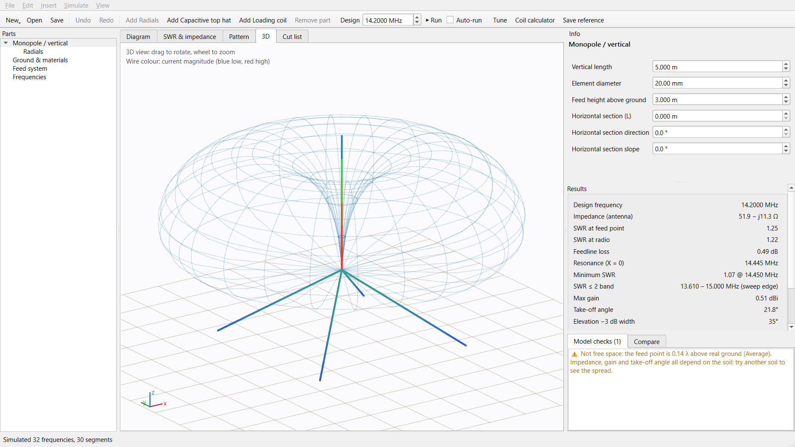
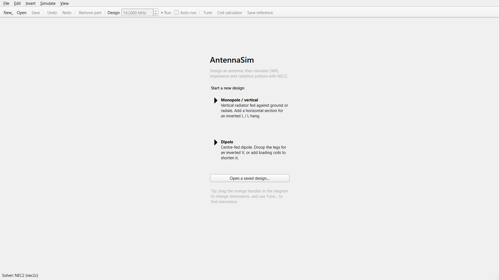

# OpenAntenna Designer

**Software that helps you quickly model and evaluate antenna designs for DIY antenna building.**

Think OpenRocket, but for antennas. Pick the kind of antenna you want to build, shape it in a simple 2D diagram, and see right away how it will perform: SWR, impedance, radiation pattern, gain, efficiency. It also gives you a cut list for building it.

Behind the diagram is a real electromagnetic simulation: the proven **NEC2** engine, the same method used by 4nec2, EZNEC and MMANA.



---

## Features

### Design
- **Antenna types you choose.** Two families so far:
  - **Monopole / vertical:** ground-mounted or elevated verticals, and inverted L / L hang.
  - **Dipole:** flat dipole, inverted V, and slopers by direction.
- **Parts:**
  - radials, modeled as wires or buried in the ground
  - capacitive top hats, with optional perimeter ring
  - loading coils with inductance and Q (a dipole gets a matched pair, one per leg)
- **2D diagram editor.**
  - Side and top views with draggable handles and live dimension lines.
  - A part tree on the left and a properties panel on the right.
  - Right-click the diagram or the tree to add and remove parts.
  - Deselect everything (click empty space in the tree, or press Escape) for an **overview** of every setting at once.
- **Environment:**
  - free space, perfect ground, or real soil (presets from city ground to salt water)
  - wire material: copper, aluminium, steel and more
- **Feed system:**
  - reference impedance
  - balun / unun ratio
  - coax type and length: RG-58, RG-8X, RG-213, LMR-400, RG-6, ladder line
- Undo / redo, metric and imperial units, and save/load as `.antsim` files.

### Results
- **At the design frequency:**
  - input impedance, SWR at the feed point and at the radio, feedline loss
  - max gain, take-off angle, elevation beamwidth, radiation efficiency
  - azimuth variation: how far from omnidirectional, and in which direction
- **Across the frequency sweep:** resonant frequency and SWR bandwidth.
- **Plots:**
  - SWR and impedance sweeps, with your zoom kept between runs and a **Reset zoom** button
  - elevation and azimuth polar patterns, the azimuth scale following the pattern's own
    variation so a fraction of a dB is still visible
  - a 3D view showing current distribution and the pattern surface
- **Comparisons:** save the current design as a reference, change something, and the plots overlay both while the results show the difference beside each value.
- **Values that moved** in the latest run are highlighted, with the previous value in the tooltip.
- **Copy to clipboard:** settings, results and the cut list all copy as plain text for your notes.

### Tools
- **Tune to resonance:** adjusts element length, coil inductance, top hat or radial length until reactance is zero. It always finds the *fundamental* resonance rather than an antiresonance or a higher-order one, whatever value you start from, and explains itself when a parameter cannot reach resonance.
- **Coil calculator:** turns, coil length and wire needed for a target inductance.
- **Cut list:** its own tab with everything you need to cut before you build.
- **Model checks:**
  - warnings when a design breaks NEC2's modeling rules, so you don't trust bad numbers
  - a standing notice of **how much the results lean on the ground**, since only free space is soil-independent
- **NEC export:** writes a `.nec` deck to cross-check your design in 4nec2 or other NEC tools.

| SWR & impedance | Radiation pattern |
|---|---|
|  |  |

| Inverted V dipole | Comparison against a saved reference |
|---|---|
|  |  |

| Overview of every setting | Cut list |
|---|---|
|  |  |

| 80 m inverted L with buried radials | 3D view |
|---|---|
|  |  |

---

## Getting started

### Requirements
- Python 3.11 or newer
- A C compiler (gcc) to build the NEC2 solver. On Windows, [WinLibs MinGW-w64](https://winlibs.com/) works well.

### Install and run

```bash
git clone https://github.com/HerrDextro/OpenAntenna-designer.git
cd OpenAntenna-designer
python -m venv .venv
```

Windows:

```bash
.venv\Scripts\python -m pip install -e ".[dev]"
.venv\Scripts\python third_party\build_nec2c.py
.venv\Scripts\python -m antennasim
```

Linux / macOS:

```bash
.venv/bin/python -m pip install -e ".[dev]"
.venv/bin/python third_party/build_nec2c.py
.venv/bin/python -m antennasim
```

You can also open a saved design directly: `python -m antennasim mydesign.antsim`.

### Quick tour
1. The app opens on a start screen. Pick **Monopole / vertical** or **Dipole**, or open a saved design.

   

2. **Drag the orange handles** in the diagram to change lengths, heights and angles.
3. Keep **Auto-run** on and results update as you edit, or press **F5**.
4. Add parts from the toolbar, or right-click the diagram or part tree.
5. Open **Tune…** to make the antenna resonant at your design frequency, then **Apply**.
6. Press **Save reference** (Ctrl+R), change something, and compare the two side by side.
7. Check the **Cut list** tab and go build it.

---

## How it works

```
Project (.antsim) → Template → 3D wire model → Model checks
      → NEC2 solver → currents & impedance → far field, SWR, feedline → results
```

- **Templates** (`src/antennasim/templates/`) turn a handful of parameters into a 3D wire model. They also describe the diagram handles, dimensions and cut list. Adding a new antenna type means writing one template. The UI, solver and analysis are shared.
- **Solver** (`src/antennasim/solver/`):
  - The `nec2c` engine is built from `third_party/nec2c` and run as a separate process.
  - Each frequency is solved in its own block, so frequency-dependent losses (coil resistance = X_L / Q) are correct across the sweep.
  - The solver sits behind an interface and can be swapped out.
- **Far-field patterns** (`src/antennasim/analysis/farfield.py`) are computed from the NEC segment currents using the reflection-coefficient ground model. The test suite checks them against NEC's own output; they agree within 0.02 dB.
- **Ground-mounted verticals over real soil:** NEC2 cannot connect a wire to lossy ground. For these, the current solution uses perfect ground plus a ground-loss resistance at the feed point, while the pattern still uses the real soil. Elevated antennas use NEC2's full Sommerfeld real-ground solution.
- **Tuning** (`src/antennasim/analysis/tuner.py`) scans upward and takes the first negative-to-positive crossing of reactance. Element length runs through a fundamental resonance, then an antiresonance (a pole, not a zero), then higher-order resonances, so simply bracketing a sign change lands on the wrong one.

### Project layout

```
src/antennasim/
  model/       project document, parameter specs, units, materials & coax data
  templates/   antenna types (monopole.py, dipole.py) and the template interface
  geometry/    wire model, automatic segmentation, model validity checks
  solver/      NEC deck writer, nec2c backend, result types
  analysis/    far field, SWR/bandwidth, feedline, ground loss, coil design, tuner
  fileio/      .antsim save/load, .nec export
  ui/          PySide6 main window, start screen, diagram editor, plots, 3D view,
               cut list, comparisons, dialogs
tests/         solver reference cases, analysis, both templates, UI smoke tests
third_party/   nec2c source + build script
```

### Tests

```bash
python -m pytest
```

The suite runs the real solver and the real UI (offscreen). It covers NEC2 reference cases (a quarter-wave monopole gives about 36 Ω, a half-wave dipole about 73 Ω), far-field agreement with NEC's own pattern output, the analysis maths, both templates, and UI behaviour including tuning, comparisons and recovery from solver failures.

---

## Roadmap

- [x] **V1:** monopole / vertical, inverted L, radials, top hat, loading coil
- [x] Dipole and inverted V, with symmetric loading coils
- [ ] Fan dipole and traps
- [ ] End-fed / random wire with unun
- [ ] Loops: resonant loop (quad / delta) and magnetic loop (with capacitor voltage and efficiency)
- [ ] Bowtie, discone, halo
- [ ] Windows installer

## Accuracy notes

Treat simulated results as a strong starting point, not a guarantee. Nearby objects, masts, walls, feedline common-mode currents and real soil all shift a real antenna.
- Only free space is soil-independent. Over ground, the soil sets the pattern and take-off angle, and below about 0.2 λ it pulls the feed impedance around as well. Model checks tells you which case you are in.
- The ground-loss resistance for buried radials is a rule-of-thumb estimate. You can enter a measured value manually instead.
- Coax loss figures are typical datasheet values.
- Loading coils are modeled as lumped RLC loads. Coil self-resonance and physical coil length are not modeled.
- Insulated wire is not modeled; cut lengths are for bare wire.

## License

The bundled NEC2 engine in `third_party/nec2c` is licensed under the GNU GPL v2 (see `third_party/nec2c/COPYING`). It is built as a separate executable and called as an external process.
